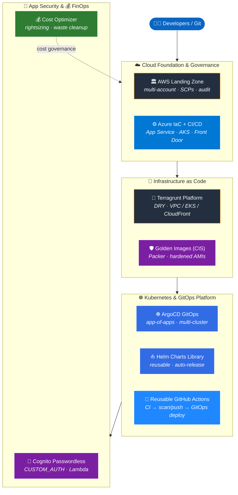

<h1 align="center">Hi, I'm Muhammad Imad 👋</h1>
<h3 align="center">Senior SRE / Platform Engineer · Multi-Cloud (AWS · Azure · GCP) · Kubernetes · GitOps</h3>

  
  
  

---

### 🚀 About Me

Results-driven **Senior SRE / Platform Engineer** with **6+ years** designing, automating, and operating scalable cloud infrastructure across **AWS, Azure, and GCP**. I build self-service platforms on **Kubernetes**, codify everything with **Terraform / Terragrunt**, ship via **GitOps (ArgoCD)** and **CI/CD pipelines**, and bake in **DevSecOps** and **cloud security** from day one.

- 🏗️ Led architectural redesign of **centralized, multi-region hybrid infrastructure** (on-prem + AWS)
- ☸️ Run **EKS, AKS, GKE, ROSA (OpenShift)** and self-managed (RKE2 / Talos) clusters via GitOps
- 💰 Drove **cost optimization across 50+ AWS accounts** — rightsizing, unused-resource cleanup, cost governance
- 🛡️ Implement **DevSecOps** — Trivy, SonarQube, TFSec, Security Hub, GuardDuty, least-privilege IAM
- 🌍 Architected **multi-region Disaster Recovery** (RTO/RPO-driven, automated failover) during a regional outage

---

### 🛠️ Tech Stack

**Cloud**

**Containers & Orchestration**

-EE0000?style=for-the-badge&logo=redhatopenshift&logoColor=white)

**IaC & Config**

**GitOps & CI/CD**

**Observability & Security**

**Languages**

---

### 🗺️ Platform Architecture — How My Work Fits Together

> Each box is one of my real projects (links in the table below) — rendered live by GitHub on every visit.

---

### 📌 Featured Projects

| Project | What it demonstrates |
|---|---|
| 🏛️ **[terraform-aws-landing-zone](https://github.com/Muhammad-Imad/terraform-aws-landing-zone)** | Multi-account AWS Landing Zone — org / network / identity / log-archive / audit hubs, SCPs, centralized logging |
| 🧱 **[terragrunt-aws-platform](https://github.com/Muhammad-Imad/terragrunt-aws-platform)** | DRY multi-account AWS platform with Terragrunt — `_envcommon` pattern, dependency-ordered VPC / EKS / S3+CloudFront modules |
| ☸️ **[argocd-gitops-platform](https://github.com/Muhammad-Imad/argocd-gitops-platform)** | App-of-apps GitOps across multiple K8s clusters & regions (ArgoCD + Helm + Kustomize) |
| ⛵ **[helm-charts-library](https://github.com/Muhammad-Imad/helm-charts-library)** | Reusable Helm charts — shared library chart + web-service & worker app charts, schema-validated, auto-released |
| 🔁 **[reusable-github-actions](https://github.com/Muhammad-Imad/reusable-github-actions)** | Reusable Actions workflows + composite actions — standardized CI → Trivy-gated build/push → GitOps deploy |
| 🔐 **[terraform-aws-cognito-passwordless](https://github.com/Muhammad-Imad/terraform-aws-cognito-passwordless)** | Reusable, DRY module — passwordless auth (email magic-link + phone OTP) on Cognito CUSTOM_AUTH + Lambda triggers |
| 🛡️ **[packer-golden-images-cis](https://github.com/Muhammad-Imad/packer-golden-images-cis)** | CIS-hardened golden AMIs (Ubuntu / RHEL / Amazon Linux / Windows) with automated builds |
| 💰 **[aws-cost-optimizer](https://github.com/Muhammad-Imad/aws-cost-optimizer)** | Python tool — multi-account cost analysis, rightsizing & unused-resource reports |
| ⚙️ **[azure-devops-iac-pipelines](https://github.com/Muhammad-Imad/azure-devops-iac-pipelines)** | Azure IaC + YAML build/release pipelines for microservices (App Services, AKS, Key Vault, Front Door) |

> 📖 Detailed engineering case studies (architecture, decisions, impact) live in each repo's README.

---

### 🎓 Certifications

<i>👆 Click any badge to view the certificate.</i>

  
  
  
   
  
  

---

### 📊 GitHub Stats

  
  

  

---

### 📫 Let's Connect

  
  

<i>📍 Based in Karachi, Pakistan · Open to Remote / Relocation Worldwide · SRE · Platform Engineering · DevOps</i>

